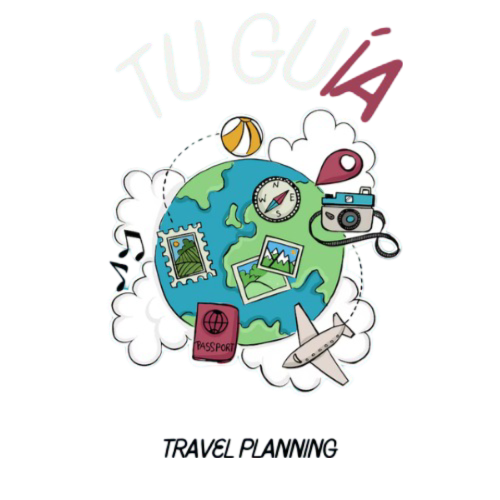

# ⭐️ TuGuIA - Tu Asistente de Viajes Inteligente

  

## 🌟 Bienvenido a TuGuIA

Bienvenido a **TuGuIA** 🌍, tu asistente personal de viajes potenciado por Inteligencia Artificial. Este proyecto revoluciona la forma de planificar viajes combinando el poder de Chat GPT, bases de datos vectoriales y APIs globales para crear experiencias de viaje únicas y personalizadas.

**Explora la aplicación en vivo**: [TuGuIA Demo](https://tuguia.streamlit.app/#17a7a59d) 🔗

## 🎯 Propósito del Proyecto

TuGuIA nace con el objetivo de resolver los principales desafíos en la planificación de viajes:

- **Personalización Real**: Recomendaciones basadas en tus preferencias específicas
- **Ahorro de Tiempo**: Reduce horas de planificación a minutos
- **Información Actualizada**: Datos en tiempo real de clima y actividades
- **Experiencia Completa**: Desde la idea inicial hasta el itinerario detallado

## 🚀 Características Principales

### 1. Sistema de IA Avanzado
- Integración con Chat GPT para recomendaciones contextuales
- Base de datos vectorial para búsqueda semántica
- Matching inteligente de preferencias

### 2. Planificación Inteligente
- Generación automática de itinerarios
- Optimización según clima y temporada
- Exportación profesional a PDF

### 3. Datos en Tiempo Real
- Pronóstico climático actualizado
- Información de lugares mediante Google Places
- Disponibilidad de actividades

## 💻 Tecnologías Utilizadas

### Frontend
- **Streamlit**: Framework principal
- **HTML/CSS**: Diseño personalizado
- **Componentes Interactivos**: Experiencia fluida

### Backend
- **Python 3.12**: Core de la aplicación
- **MySQL**: Base de datos en Google Cloud
- **OpenAI GPT**: Motor de IA
- **Pinecone**: Base de datos vectorial

### APIs y Servicios
- OpenAI API
- Google Places API
- OpenWeatherMap API
- Google Cloud Platform

## 📊 Arquitectura del Sistema

### Base de Datos
- **MySQL**: Almacena información de usuarios, preferencias y actividades.
- **Pinecone**: Base de datos vectorial para búsqueda semántica de actividades.

### APIs Utilizadas
- **OpenAI API**: Generación de recomendaciones y procesamiento de lenguaje natural.
- **Google Places API**: Obtención de imágenes y detalles de lugares.
- **OpenWeatherMap API**: Pronóstico del clima para destinos específicos.

### Flujo de Datos
1. **Usuario**: Ingresa sus preferencias y destino.
2. **Backend**: Procesa la información y consulta las APIs.
3. **IA**: Genera recomendaciones y itinerarios personalizados.
4. **Frontend**: Muestra los resultados y permite la descarga del itinerario en PDF.

## 📈 Resultados Esperados
- **Mejora en la planificación de viajes**: Usuarios pueden planificar viajes de manera eficiente y personalizada.
- **Aumento de la satisfacción del usuario**: Recomendaciones precisas y útiles basadas en preferencias individuales.
- **Optimización del tiempo**: Reducción significativa del tiempo dedicado a la planificación de viajes.

## 🔮 Futuras Mejoras

### 1. Expansión de la Base de Datos Vectorial
- **Nuevas Actividades**: A partir de los destinos ingresados por los usuarios, se agregarán nuevas actividades a la base de datos vectorial para mejorar las recomendaciones futuras.
- **Enriquecimiento de Datos**: Integración de más fuentes de datos para enriquecer la información de actividades y destinos.

### 2. Soporte para Múltiples Usuarios
- **Preferencias de Grupo**: Permitir que los usuarios ingresen preferencias de más personas para generar itinerarios que satisfagan a todos los miembros del grupo.
- **Colaboración en Tiempo Real**: Funcionalidad para que varios usuarios puedan colaborar en la planificación de un viaje en tiempo real.

### 3. Integración con Redes Sociales
- **Compartir Itinerarios**: Posibilidad de compartir itinerarios y recomendaciones en redes sociales.
- **Opiniones y Valoraciones**: Permitir a los usuarios dejar opiniones y valoraciones sobre las actividades y destinos visitados.

## 👨‍💻 Autor

**Esteban Daniel Cristos Muzzupappa**

- [LinkedIn](https://www.linkedin.com/in/esteban-cristos-m/)
- [GitHub](https://github.com/estcr)

¡Gracias por visitar TuGuIA! Esperamos que disfrutes planificando tus próximas aventuras con nosotros. 🌍✈️
